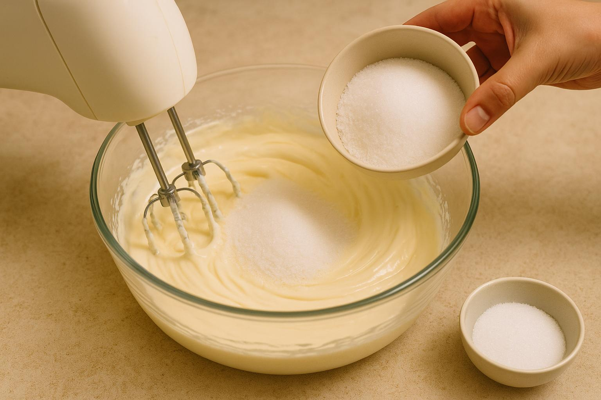

<!DOCTYPE html>
<html>
<body style="background-color:rgba:(238, 213, 159, 0.9);">

<h1 style="text-align: center; font-size:200%; font-family: comic sans ms;">
   Whats COOKING Today???? 
</h1>

<h2 style="text-align: center; font-size:175%; font-family: comic sans ms;">
<b>
<i>
<u>
   TIRAMISU 
</u>
</b>
</i>
</h2>

Meet your new obsession: 
<b>
<i> 
<u>
  Tiramisu! 
</u>
</i>
</b>
  A luscious, coffee-kissed dessert stacked with velvety mascarpone and cocoa magic. 
  One bite, and you're floating in flavor heaven.

<b>
<i>
     Dont you guys wanna make it??
</i>
</b>

      Let's begin!!! 

<i>
    Whipped cream, bold coffee, sneaky biscuits, and a cocoa dusting — it’s like a dessert pajama party!
</i>

<b>
<i> 
    Here’s what goes into making this dreamy bite! 
</i>
</b>
    1. Fresh cream 
    2. Coffee 
    3. Finger Biscuits 
    4. Sugar 
    5. Cheese 
    6. Condensed Milk 
    7. Vanilla Essence 
    8. Cinnamon Powder 
    9. Cocoa Powder 
    10. Water

<i> 
<b>
Keep'em all ready to load!!
</i>
</b>

<i> 
Tools of the trade — let’s get mixing, dipping, and sprinkling!
</i>
    1. Electric whisker
    2. Whisking bowl
    3. Spatula
    4. Forceps
    5. Sieve
    6. Spoon
    7. Serving Dish

<i> 
   That’s 
<b><u>cream</u></b>
   getting its glow-up — whipped to fluffy perfection!
</i>

<i>
   Golden, gooey goodness — meet 
<b><u>condensed milk</u></b>, 
   the dessert’s best friend!
</i>

<i>
    Not just any 
<b><u>cheese</u></b>
    — this one melts into pure dessert luxury.
</i>

<i>
   A sprinkle here, a swirl there — 
<b><u>sugar’s</u></b>
   doing the sweet talking.
</i>

<i> 
   A tiny bottle with big charm — 
<b><u>vanilla essence</u></b>
     adds the cozy vibes!
 </i>

<i> 
Just a pinch of 
<b>
<u> 
	Cinnamon
</u>
</b>
because desserts deserve a little spice and sass.
</i>

</body>
</html>
